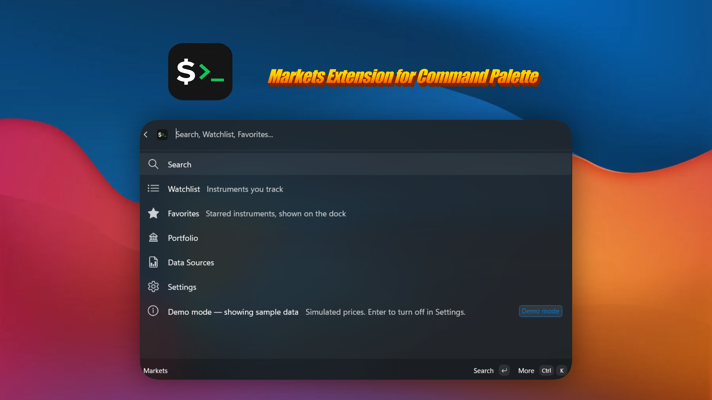
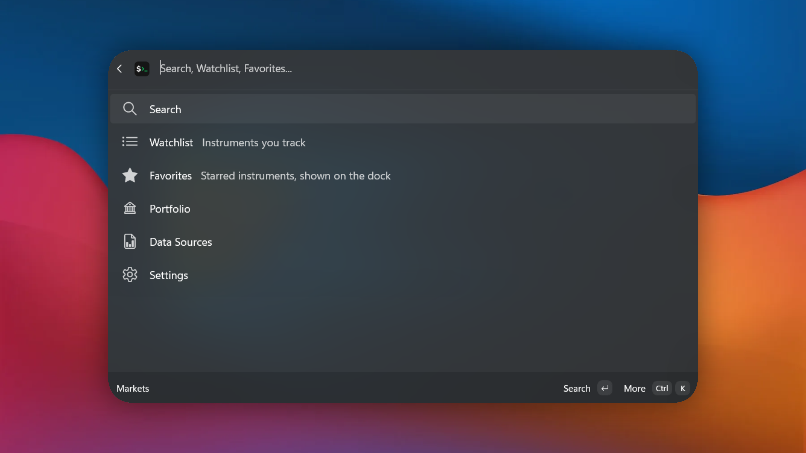
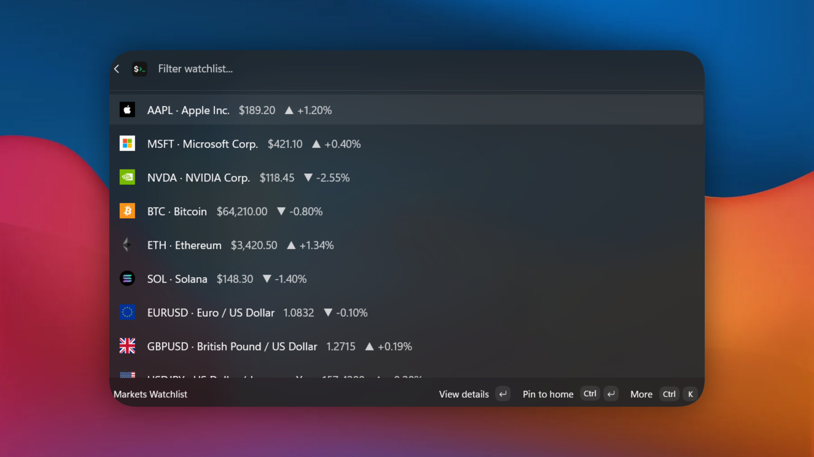
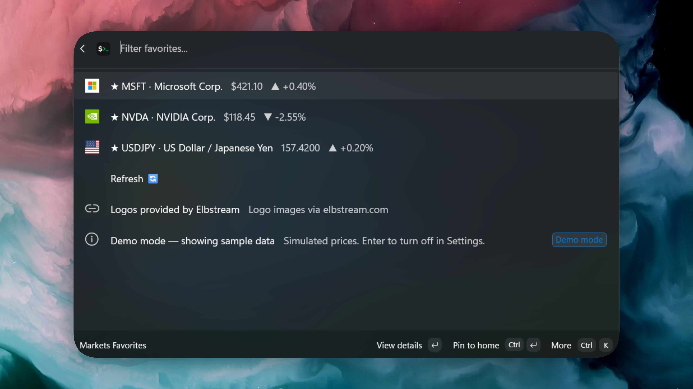
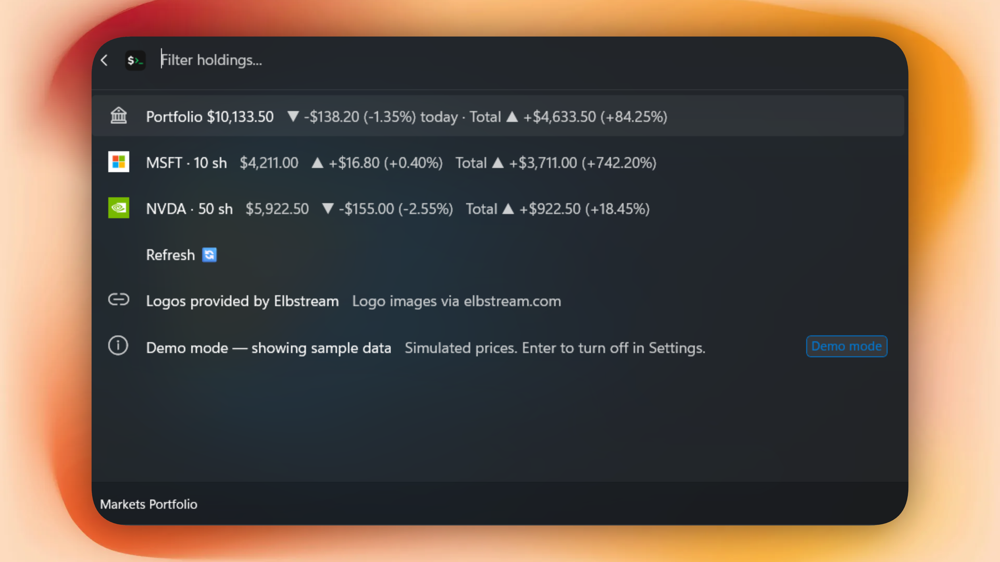
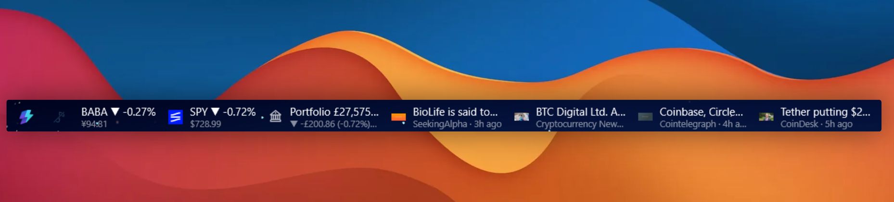

# Markets Extension for Command Palette

A Windows 11 [Command Palette](https://learn.microsoft.com/en-us/windows/powertoys/command-palette/overview) (PowerToys) extension for **stock, crypto, and currency** market data.

## Requirements

- [PowerToys](https://github.com/microsoft/PowerToys) with Command Palette enabled
- A [Twelve Data](https://twelvedata.com/) or [Finnhub](https://finnhub.io/) API key for live data (paste it into the extension's settings) — or just turn on **Demo mode** and explore offline with sample data

## Installation

### Microsoft Store

### WinGet

Soon!

## Features

### The Markets hub

One top-level **Markets** command opens the hub: Search, Watchlist, Favorites, Portfolio, Data Sources, and Settings.

### Search & detail charts

Search stocks, crypto, and FX, then open any symbol for a live price and a 1D / 1W / 1M / 1Y / 5Y chart.

### Watchlist

Track a list of instruments with live prices and daily change across stocks, crypto, and currencies.

### Favorites

Star the instruments you care about most for quick access — also surfaced on the dock.

### Portfolio

Enter your own holdings and cost basis to see position value, daily change, and total return — with multi-currency totals.

### Dock integration

Pin **Favorites**, your **Portfolio**, and a **News** ticker to the Command Palette dock for an at-a-glance band of quotes and headlines.

### Demo mode

No API key? Turn on **Demo mode** to explore the whole extension with sample data, fully offline.

## FAQ

**I don't want to use my own API keys. Can't you provide one out of the box?**
That would require a commercial licence.

**Will you steal my API keys?**
I don't care about your keys. Read the source code.

**Is there telemetry?**
No.

**Do I need an account?**
No.

**Can you add _&lt;insert favorite provider here&gt;_?**
I accept large sums of money as a bribe to entertain that thought.

## License

[MIT](LICENSE)
